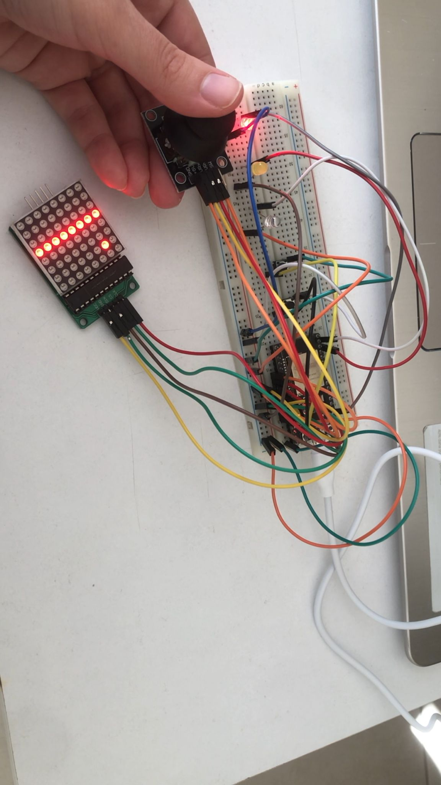
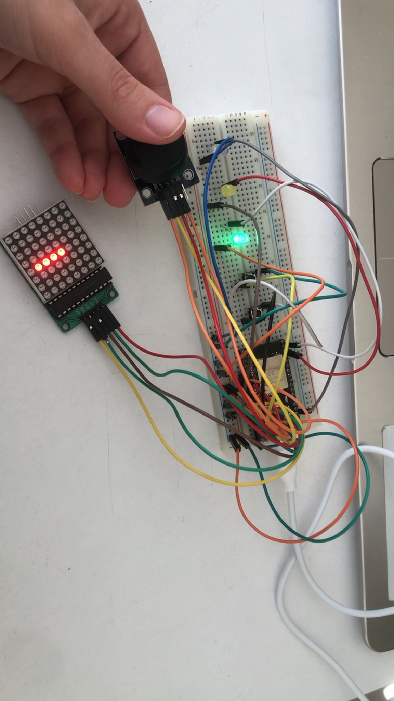
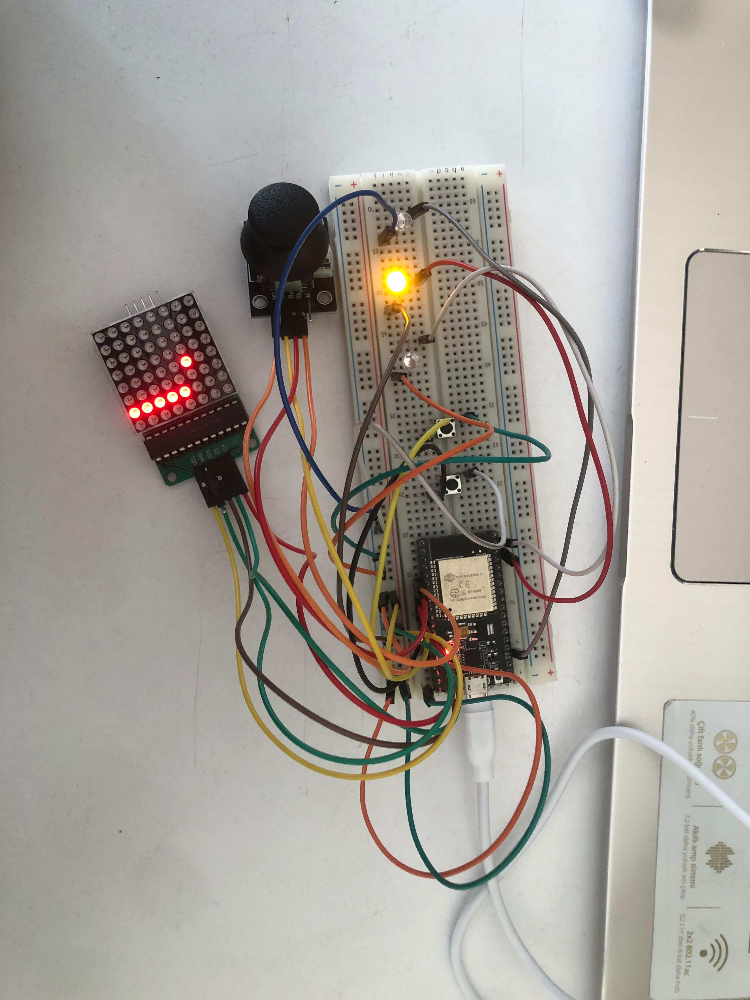

This project is a classic Snake game implemented on an ESP32 microcontroller using an 8x8 LED dot matrix display (MAX7219 module) and a joystick for control. The game includes additional hardware features such as LEDs and buttons for reset, pause, and game events.

# Game Over State

Snake collides with itself → game resets and red LED turns on.

---

# Bait Eaten State

Snake eats bait → grows and green LED flashes.

---

# Pause State

Game is paused by button → yellow LED turns on.

